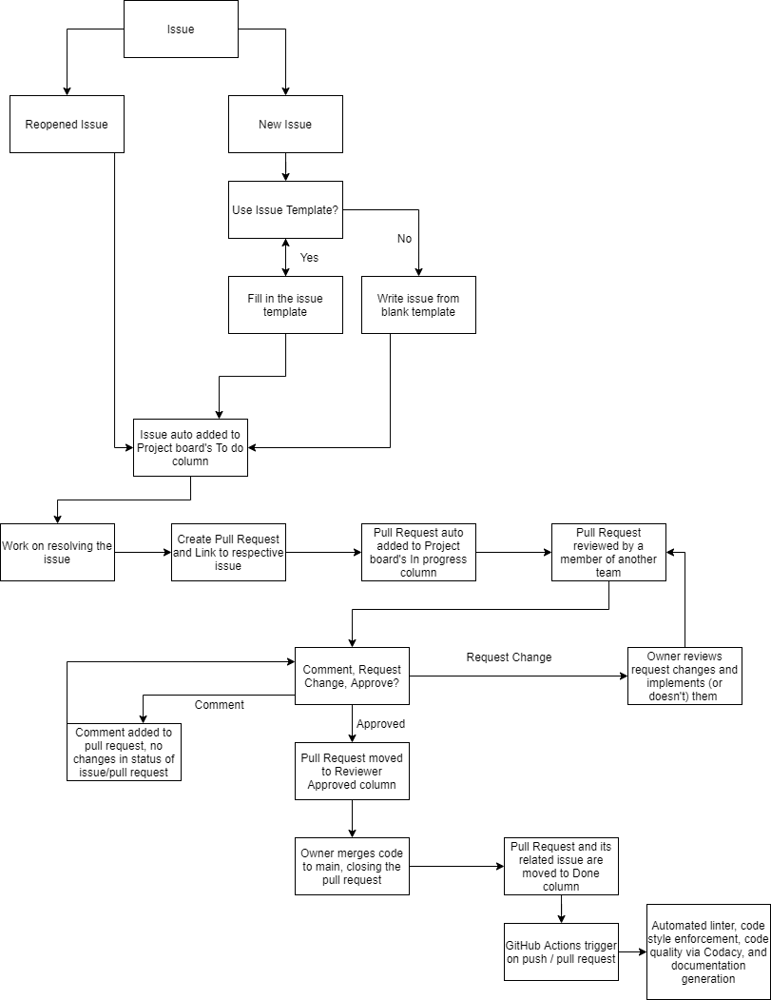

# CI/CD Pipeline Phase 1

## Current Functionality

The CI/CD pipeline is currently able to auto-assign issues/pull requests to the project board, lint code, enforce code style, check code quality via tool, check code quality via human review, and generate documentation

- Auto-assign issues/pull requests to project board
  - Created project board
    - Enabled automation for the columns: To do, In progress, Reviewer approved, Done
    - Issues are placed in To do
    - Pull requests are placed in In progress
    - Approval of pull requests moves them to Reviewer approved
    - Issues and Pull Requests that are closed are moved to Done
- Linting and Code Style enforement
  - Utilized GitHub's superlinter GitHub actions in the workflow in order to automate the linting and code style enforcement of any code that is pushed to main.
  - Badge from the Lint Code Base is shown on README.me.
- Code quality via tool
  - Utilized Codacy to check code quality in the repo.
  - Badge of code quality status is shown on README.me.
    - Grades range from F to A
- Code quality via human review
  - Setup teams in the organization and assigned team members to the correct role
    - Teams: Frontend, Backend, QA, UI/UX
  - Used branch protection on "main" in order to enforce pull request reviews
    - pull requests require 1 review from another team in order to be approved
- Documentation Generation
  - Utilized JSDoc GitHub action in the workflow in order to automate the create of documentation from javascript files.
  - Documentation that is created is pushed to a separate repo under the same organization
    - GitHub Pages hosts the website for the documentation

## In progress

Features currently in progress in the CI/CD pipeline is unit tests via automation and e2e testing via automation

- Unit testing and e2e testing was setup in the repo, as shown in Lab 8, using Jest and Puppeteer
  - Test folder has been created and holds e2e.test.js and unit.test.js
  - The files are currently empty as no tests have been written and the web app has not been published/hosted for e2e testing
- GitHub actions workflow file has been created to install 3 Node.js versions and run the tests that are defined in the "__tests__" folder on each version
  - Currently disabled in GitHub actions as the web app has not been published/hosted
- A majority of the code is in progress at the time of writing this so it is difficult to create unit tests

## Planned

Features planned for Phase 2 include code coverage reporting

- Code coverage is a feature within Codacy and should be simple to implement

## Diagram of Pipeline

