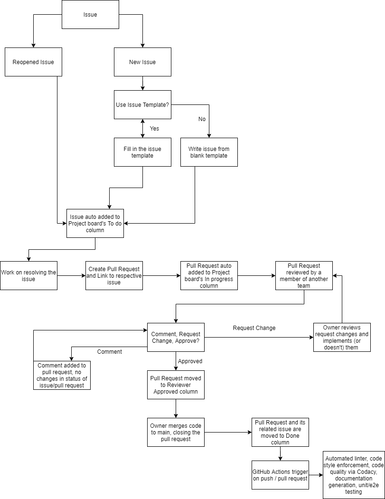

# CI/CD Pipeline Phase 1

## Current Functionality

The CI/CD pipeline is currently able to auto-assign issues/pull requests to the project board, lint code, enforce code style, check code quality via tool, check code quality via human review (pull requests), generate documentation, automate testing, and generate a code coverage report

### Auto-assign issues/pull requests to project board
- Created project board
  - Enabled automation for the columns: To do, In progress, Reviewer approved, Done
  - Issues are placed in To do
  - Pull requests are placed in In progress
  - Approval of pull requests moves them to Reviewer approved
  - Issues and Pull Requests that are closed are moved to Done
### Linting and Code Style enforcement (Super Linter)
- Utilized GitHub's superlinter GitHub actions in the workflow in order to automate the linting and code style enforcement of any code that is pushed to main.
- Workflow on pull requests and pushes to main
- Badge from the Lint Code Base is shown on README.me
- [Super Linter Repo](https://github.com/github/super-linter)
### Code quality via tool
- Utilized Codacy to check code quality in the repo.
  - [Codeacy Dashboard](https://app.codacy.com/gh/cse110-fa21-group15/cse110-fa21-group15/dashboard?utm_source=github.com&utm_medium=referral&utm_content=cse110-fa21-group15/cse110-fa21-group15&utm_campaign=Badge_Grade)
- Fix styling mistakes to conform with the standard style guides in Codacy
- Updates on commits to main
- Badge of code quality status is shown on README.me.
  - Grades range from F to A
### Code quality via human review
- Setup teams in the organization and assigned team members to the correct role
  - Teams: Frontend, Backend, QA, UI/UX
- Used branch protection on "main" in order to enforce pull request reviews
  - Pull requests require 1 review from another team in order to be approved
  - Linting, Node.js testing, Auto-Assign, Code Coverage, Documentation Generation, and Deployment checked during pull requests
  - Linting must pass before being merged
  - Administrator can override review requirement and force push
### Documentation Generation
- Utilized JSDoc GitHub action in the workflow in order to automate the create of documentation from javascript files.
  - [JSDOC Action Repo](https://github.com/andstor/jsdoc-action)
- Documentation that is created is pushed to a separate repo under the same organization
  - [Documentation Repo](https://github.com/cse110-fa21-group15/cse110-fa21-group15.github.io)
  - GitHub Pages hosts the website for the documentation
    - [Published Documentation](https://cse110-fa21-group15.github.io/)
- Workflow on pull requests and pushes to main involving js files
### Automatic Testing
- Tests located in "__tests__" folder
- Utilized unit testing, using [happydom environment](https://github.com/capricorn86/happy-dom) and jest, to test non-API functions
  - Files with Firebase imports had unresolvable conflicts
  - API functions were too unfeasible to unit test as the functions could not be incapsulated
- Utilized end-to-end testing, through jest-puppeteer, to test UI functionality of webpage
- GitHub Actions workflow file installs 3 Node.js versions and run the tests that are defined in the "__tests__" folder on each of the 3 version
  - Unit tests ran in happydom environment
  - End-to-End tests ran in default environment
- Workflow on pull requests and pushes to main 
### Code Coverage
- Utilized [Jest Github Action](mattallty/jest-github-action@v1) to run unit tests in happydom environment
- Coverage Report generated from tests and posted as comment in pull request
- Workflow on pull requests

## Diagram of Pipeline

