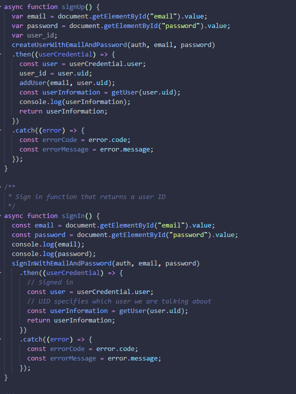
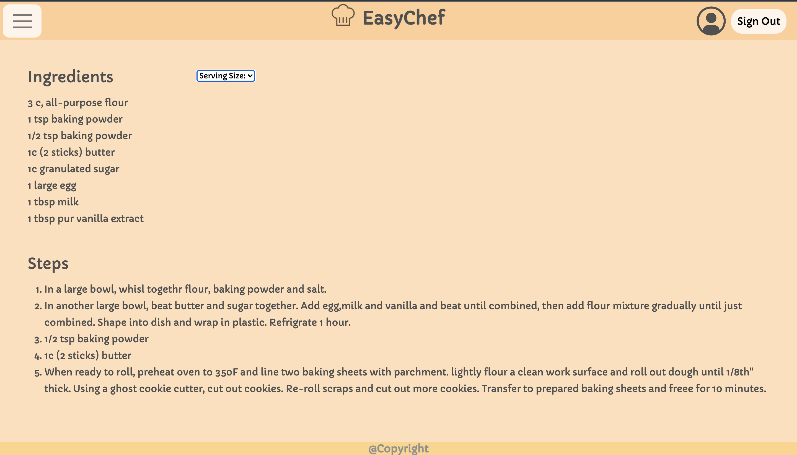

**Type of Meeting**:

**Date**:

**Agenda**

- First sprint review. Each member will discuss accomplished items throughout the sprint and demo work.

**Attendance**
- Daryl Foo               -- Yes
- Elias Arghand           -- Yes
- Jasmine Wang            -- Yes
- Jonathan Padungyothee   -- Yes
- Lavanya Verma           -- Yes
- Likith Palabindela      -- Yes
- Madelyn Mirai Adams     -- Yes
- Naweed Malal            -- Yes
- Sahil Bhalla            -- Yes
- Xiaoye Zuo              -- Yes 

**Accomplishments Per Team Member**
- Daryl Foo:    
The high fidelity wireframes with updated log in.
Will be helping out integrate front end with back end next week.

- Elias Arghand:   
  - Created Firebase user Authentication and databse creation with users, each having a unique user id, email, password, and list of favorite recipes. Also helped out with APi calls from Spoonacular.
  - Will continue working on creating more CRUD functions for creating recipes and adding favorite recipes to the database.

- Jasmine Wang:
  - Created sign in and sign up pages. This week I will help out the front end to connect pages.

- Jonathan Padungyothee:   
Used github actions to create scripts to auto lint code, auto add to project, and auto generate jsdocs. Used Codacy to get styling grade (which is posted as a badge on the README). This week I will work on fixing the pull requests (review by human) and set up unit testing.

- Lavanya Verma:  
  - The frontend pages for uploading recipes, after they have been added and a general recipe page
Will be working on integration with js and google log in (firebase)

- Likith Palabindela: 
    - Conducted research on adding unit tests to GitHub actions, and looked into integrating more automation tools. This week I hope to setup unit testing for the project and get started with end to end testing.

- Madelyn Mirai Adams:    
  - created skeleton pages for the search results, home page, and meal plan. Began connecting pages. This week I will continue to connect pages. 

- Naweed Malal:  
  - Created recipe cards using the example JSON files on Spoonacular in the personal cookbook page, and created the recipe upload page.
Will be working on connecting pages together according to the high fidelity wireframes.

- Sahil Bhalla:
  - Researched the spoonacular documentation and API calls in javascript. Helped work on the search query function. This week I will work on API calls for filtering and more complex requests for recipes. (edited) 

- Xiaoye Zuo:      
  - Created API search query call, redirect page function, and local recipe storage function. This week I'll keep working on adding search/filter queries based on user input.

         
**Project Updates/Issues**   

**High Points**

- API is fully functional and has all necessary information to populate information on each page.
- CI/CD pipeline is fully setup.
- Everyone completed all required tasks for the sprint and presented high effort.
- All skeleton pages done on the frontend

**Topics for Next Meeting**

**Duration**

- 45 Minutes