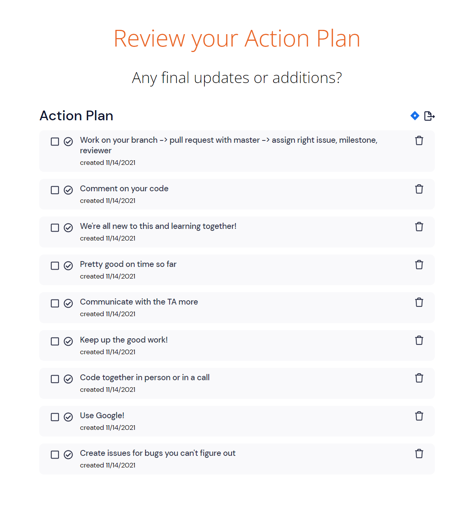

**Type of Meeting**:

**Date**:

**Agenda**

**Attendance**
- Daryl Foo               -- Yes
- Elias Arghand           -- Yes
- Jasmine Wang            -- Yes
- Jonathan Padungyothee   -- Yes
- Lavanya Verma           -- Yes
- Likith Palabindela      -- Yes
- Madelyn Mirai Adams     -- No
- Naweed Malal            -- Yes
- Sahil Bhalla            -- Yes
- Xiaoye Zuo              -- Yes 

**Last Meeting Stuff**
- Daryl Foo:               
- Elias Arghand:           
- Jasmine Wang:            
- Jonathan Padungyothee:   
- Lavanya Verma:           
- Likith Palabindela:     
- Madelyn Mirai Adams:     
- Naweed Malal:            
- Sahil Bhalla:            
- Xiaoye Zuo:       
         
**Project Updates/Issues**   
- Be sure to follow specific styling
- Daryl and Jasmine will be in charge of connecting user auth and navigation between pages with user id.
**Struggles**
- Bugs and errors such as CSS and Javascript errors with Firebase.
- Lack of communication between teams.
- Doing this project the "SWE" way
- Not enough time to code

**Solutions**
- Asking each other for help and using research (Googling).
- In person work sessions to improve communication.
- Try to come to lecture if you can.
- Coding sessions in person, possibly one this week!

**What we are glad about**
- Everybody completing their tasks.
- High effort from everyone on the team.
- Nobody dominates each other.
- People are willing to go to other groups and help out.
- Designs came out well!
- API Calls and User Auth is working great.

**Action Plan**

**Topics for Next Meeting**
- When to meetup and have a coding session.
- Checkups for any blockers and continuing the week.

**Duration**
- 1 hour and 8 minutes