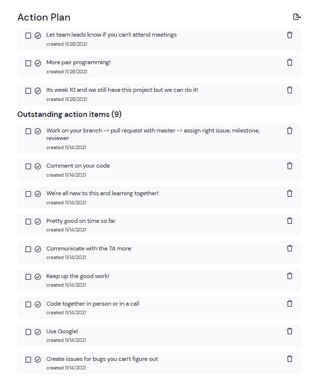

**Type of Meeting**:
- Agile retrospective

**Date**:
- November 28, 2021

**Agenda**

- Discuss about the last sprint.
- Discuss clarity, mastery, autonomy, etc.
- Mad, Sad, Glad

**Attendance**
- Daryl Foo               -- Yes
- Elias Arghand           -- Yes
- Jasmine Wang            -- Yes
- Jonathan Padungyothee   -- Yes
- Lavanya Verma           -- Yes
- Likith Palabindela      -- Excused
- Madelyn Mirai Adams     -- Yes
- Naweed Malal            -- Yes
- Sahil Bhalla            -- Excused
- Xiaoye Zuo              -- Excused

**Last Meeting Stuff**
- Daryl Foo:               
- Elias Arghand:           
- Jasmine Wang:            
- Jonathan Padungyothee:   
- Lavanya Verma:           
- Likith Palabindela:     
- Madelyn Mirai Adams:     
- Naweed Malal:            
- Sahil Bhalla:            
- Xiaoye Zuo:       
         
**Mad/Sad/Glad Topics**   
- Sad: Time Constraints
  - Not enough time to perfect everything & we also have to work alongside finals/week 10 work
  - Can't change this constraint too much due to structure of the class and quarter system but we are on a good pace with our MVP
- Sad: Not enough pair programming / group work
  - There was one coding session but as we wind down to the end of the quarter it is tough to schedule more
  - Group coding sessio was very productive and paired programming is just as effective
- Mad: Bugs
  - image bugs
- Sad: Meeting Attendance
  - Notify a team lead if you cannot make zoom or in-person
- Glad: Communication
  - Communication has improved between teams, especially during connection of frontend to backend for MVP
- Mad: Being told about discussion plans late
  - Told video was going to be used day of
- Mad: Extra workload
  - Dealing with finals and other classes
- Sad: Lack of meeting precise deadlines
  - Set harder dealines
  - Meet deadlines to not slow down other teams
- Glad: CI/CD pipeline
  - No issues so far
- Glad: Website flow
  - Deployment of site was smooth and most of the functionality is there
- Glad: On track
  - Hitting deadline and well on track to get our final product
  - Could get stretch features done
- Sad: People being on different pages
  - Communicate to a team lead or other group members to discuss it and clarify any details
- Sad: Merge issues
  - Some code got undid when a branch was merged

**Action Plan**

**Topics for Next Meeting**
- Last push in the quarter
- Comment code
- Perform merge conflicts correctly

**Duration**
- 1 hour
