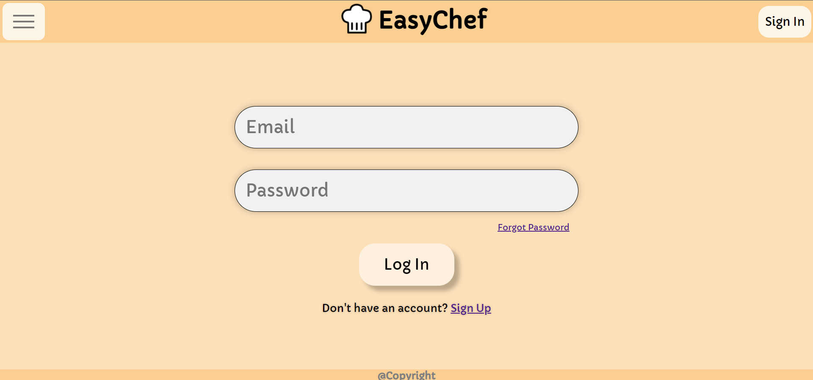

**Type of Meeting**:

- Sprint Review 2

**Date**:

- November 29, 2021

**Agenda**

- Second sprint review. Each member will discuss accomplished items throughout the sprint and demo work that led up to the MVP.

**Attendance**
- Daryl Foo               -- Yes
- Elias Arghand           -- Yes
- Jasmine Wang            -- Yes
- Jonathan Padungyothee   -- Yes
- Lavanya Verma           -- Yes
- Likith Palabindela      -- Yes
- Madelyn Mirai Adams     -- Yes
- Naweed Malal            -- Yes
- Sahil Bhalla            -- Yes
- Xiaoye Zuo              -- Yes 

**Accomplishments Per Team Member**
- Daryl Foo:    
  - Implemented the Log In and Sign Up features on every page and worked on getting user sessions.
  
    

- Elias Arghand:   
  - Helped connect frontend and backend pages for the MVP. Completed CRUD functions from Firebase and modified the database schema to store user created recipes. Also deployed the website using Netlify.

- Jasmine Wang:
  - Tried to connect the pages and created icons such as the delete icon.

- Jonathan Padungyothee:   
  - This sprint I added a check functionality to pull requests, added citation to all community GitHub Actions code, fixed the target of the auto-linter, created a script to automate testing on pushes to main / pull requests, and started working on e2e tests.

- Lavanya Verma:  
  - Since the last sprint, I have worked on connecting pages and fixed bugs on styling with uploadRecipe page when minimized getting unaligned. Added functionality to the save button and fixed the reroute issue. Helped out on the firebase rules and database structure.

- Likith Palabindela: 
  - Tried unit testing functions, but they were all API function calls that couldn’t be tested. Instead, I started working on end-to-end testing, starting with the sign up and login pages.

- Madelyn Mirai Adams:    

- Naweed Malal:  
  - Modified the recipe page to load recipe information, created edit recipe page, worked with backend to finalize CRUD features, and modified recipe cards.
  

- Sahil Bhalla:
  - Since the last sprint worked in and created a filtering system and tied them to the menus on all the webpages that have them. Just need to manage the api costs for strict filters and integrate the recipes with the recipe cards

- Xiaoye Zuo:      
  - Assisted in completing the backend API calls from Spoonacular along with the search filters and parameters for each query.
         
**Project Updates/Issues**   
-Minor bug with updating images when updating the recipe.
-Deployed version is fully functional.

**High Points**

- MVP is fully functional and each CRUD function works accordingly.
- Filtering system for Spoonacular is complete
- Everyone completed all required tasks for the sprint and presented high effort.
- User AUTH is fully functional with user specific recipes.
- Demo video went smooth with no complications on the pages.
- Deployed version works the same as the local version.

  

**Topics for Next Meeting**

- Agile retrospective (discuss changes for next sprint)

**Duration**

- 45 Minutes